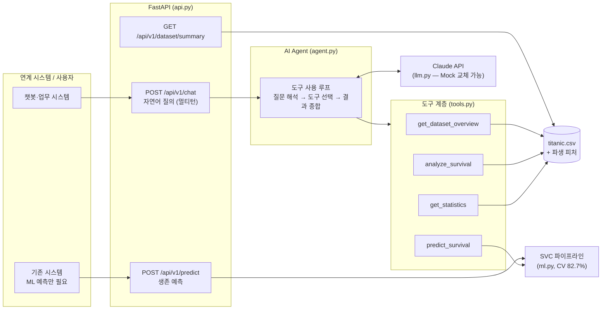

# LLM Data Analyst Agent


**자연어 질문을 도구 호출로 해석해 데이터 분석과 ML 예측을 수행하는 LLM 기반 AI Agent + 시스템 연계 REST API**

> "여성과 남성의 생존율을 비교해줘" → 에이전트가 분석 도구를 스스로 호출 → 실제 데이터 수치를 근거로 답변

타이타닉 승객 데이터셋(891명)을 대상 도메인으로 사용하며, Kaggle EDA 노트북 수준의 분석 자산을
**프로덕션 수준의 AI Agent 서비스**로 발전시키는 전 과정을 담은 포트폴리오 프로젝트입니다.

## 왜 이 프로젝트인가

LLM 기반 AI Agent 개발의 핵심 역량 4가지를 하나의 동작하는 시스템으로 증명하는 것이 목표입니다.

| 역량 | 이 프로젝트에서의 구현 | 산출물 |
|---|---|---|
| **① 대상 업무·데이터의 이해와 분석** | 데이터셋 스키마·결측치·편향 분석, EDA → 재사용 가능한 데이터 모듈로 정리 | [docs/01-data-understanding.md](docs/01-data-understanding.md), `src/titanic_agent/data.py` |
| **② AI Agent 개발 전략 수립** | 도구 설계 원칙(임의 코드 실행 금지), 수동 루프 채택 근거, 모델·프롬프트 전략, 확장 로드맵 | [docs/02-agent-strategy.md](docs/02-agent-strategy.md) |
| **③ AI Agent 개발 및 테스트** | tool-use 에이전트 루프 구현 + Mock LLM 기반 결정적 테스트 38건 (API 키 불필요) | `src/titanic_agent/agent.py`, `tests/`, [docs/04-test-strategy.md](docs/04-test-strategy.md) |
| **④ 시스템 연계 API 개발** | FastAPI REST API — 에이전트 질의(/chat)와 LLM 없이 동작하는 ML 예측(/predict) 분리 설계 | `src/titanic_agent/api.py`, [docs/03-api-spec.md](docs/03-api-spec.md) |

## 아키텍처



**동작 예시** — `"30세 여성이 1등석에 탔다면 생존했을까?"`

1. 에이전트가 질문을 해석해 `predict_survival(pclass=1, sex="female", age=30)` 호출을 결정
2. 도구 계층이 ML 파이프라인으로 생존 확률 계산 → JSON 반환
3. LLM이 결과 수치를 인용해 한국어로 답변 (+ 확률 기반 추정임을 안내)

## 실행 예시 (실제 출력)

실제 Claude API(`claude-opus-4-8`)로 실행한 E2E 스모크 테스트 결과 그대로입니다.

> **질문:** 성별 생존율을 비교해줘
> `[도구] analyze_survival({'group_by': 'Sex'}) → 완료`
>
> 성별 생존율을 비교한 결과, **여성의 생존율이 남성보다 압도적으로 높았습니다.**
>
> | 성별 | 인원 | 생존자 | 생존율 |
> |------|------|--------|--------|
> | 여성 | 314명 | 233명 | **74.2%** |
> | 남성 | 577명 | 109명 | **18.9%** |
>
> 여성 생존율(74.2%)은 남성(18.9%)의 약 **3.9배**에 달합니다. (…)
> ※ 위 수치는 1912년 타이타닉 승객 891명 표본에 기반한 결과이며, 일반적인 재난 상황 전체로 일반화하기는 어렵습니다.

> **질문:** 30세 여성이 1등석에 탔다면 생존했을까?
> `[도구] predict_survival({'pclass': 1, 'sex': 'female', 'age': 30}) → 완료`
>
> **생존했을 가능성이 높습니다.** 예측 결과 생존 확률은 **약 87.9%**로, 모델은 생존으로 분류했습니다. (…)
> 이 결과는 학습된 머신러닝 모델(SVC, 5-fold 교차검증 정확도 82.7%)이 산출한 **확률 기반 추정치**이며, 실제 특정 인물의 결과를 단정하는 것은 아닙니다.

> **질문:** 선장 이름이 뭐야? *(범위 밖 질문 — 도구 호출 없음)*
>
> 타이타닉 승객 데이터셋(891명 표본)에는 선장에 대한 정보가 포함되어 있지 않아 데이터로는 확인할 수 없습니다. (…)

세 응답 모두 시스템 프롬프트의 규칙(도구 수치 인용, 추정치 명시, 범위 밖 질문 거부)이 그대로 지켜진 것을 확인할 수 있습니다.

## 핵심 설계 결정 3가지

1. **임의 코드 실행 대신 구조화된 도구** — LLM에 pandas 코드 실행 권한을 주지 않고,
   허용된 컬럼·연산만 받는 4개 도구를 노출합니다. 프롬프트 인젝션이 성공해도 피해 범위가
   "허용된 조회"로 제한됩니다. ([전략 문서 §3](docs/02-agent-strategy.md))
2. **LLM 추상화 + Mock** — 에이전트 루프가 SDK가 아닌 인터페이스에 의존해,
   API 키 없이도 전체 흐름을 결정적으로 테스트합니다. CI 비용 0원. ([테스트 전략](docs/04-test-strategy.md))
3. **LLM 의존/비의존 API 분리** — ML 예측·데이터 조회 엔드포인트는 LLM 없이 동작합니다.
   연계 시스템이 필요한 만큼만 도입할 수 있고, LLM 장애가 ML 서비스로 전파되지 않습니다.

## 겪은 문제와 해결 (트러블슈팅)

구현 후 4개 관점(정확성·견고성·문서 일치성·API 규약)의 코드 리뷰를 거쳐 결함 10건을 찾아
수정했고, **모든 수정에 재현 회귀 테스트를 남겼습니다** (테스트 30건 → 38건, 커밋 이력 참고).
대표 사례 3가지:

**1. `max_tokens`로 잘린 턴이 대화 세션을 영구 손상시키는 문제**
- **증상**: 응답이 길이 제한에 걸리며 끝난 턴에 도구 호출(tool_use)이 포함되어 있으면,
  결과 없는 도구 호출이 대화 이력에 남음. 같은 세션의 다음 요청부터 LLM API가
  "미결 tool_use" 오류(400)를 반환 → 세션 복구 불가
- **원인**: 에이전트 루프가 `stop_reason == "tool_use"`일 때만 도구를 실행하도록 분기
- **해결**: 분기 기준을 stop_reason이 아니라 **tool_use 블록의 존재 여부**로 변경.
  잘린 턴이라도 완결된 도구 호출은 실행해 이력을 항상 유효한 상태로 유지

**2. LLM이 도구 스키마를 어긴 입력을 보내면 서버가 500으로 죽는 문제**
- **증상**: `filters`에 객체 배열 대신 문자열(`"Age > 30"`)이 오면 `AttributeError`가
  에이전트 루프를 뚫고 올라와 API 500 발생
- **원인**: LLM의 도구 입력은 스키마를 "대체로" 지키지만 보장되지 않는다는 점을 간과
- **해결**: 실행기에서 입력 형태를 재검증하고, 모든 오류를 `is_error` 도구 결과로 변환해
  **LLM이 오류 메시지를 읽고 스스로 재시도**하도록 설계 (오류 메시지에 허용 목록 포함)

**3. 도구 결과의 NaN이 표준 위반 JSON을 만드는 문제**
- **증상**: 필터 결과가 1행이면 표준편차가 `NaN` → `{"std": NaN}` 출력 (RFC 8259 위반).
  `!=` 필터는 pandas 의미론상 결측 행을 포함해 통계를 왜곡
- **해결**: NaN/inf → `null` 치환, `!=` 필터에 결측 제외 결합, 그룹 키 결측 인원을
  결과에 명시(`excluded_missing_group_key`)해 LLM이 표본 크기를 정확히 인용하게 함

> 공통 교훈: **LLM을 신뢰 경계 밖의 입력원으로 취급**해야 한다는 것.
> 도구 계층이 모든 비정상 입력을 흡수하면 에이전트는 "실수해도 정정하는" 시스템이 된다.

## 빠른 시작

```bash
git clone https://github.com/sokldjs554/llm-data-analyst-agent.git
cd llm-data-analyst-agent
pip install -r requirements.txt
```

**1) 테스트 (API 키 불필요)**

```bash
python -m pytest tests/ -v        # 38 passed
```

**2) 오프라인 데모 (API 키 불필요)** — Mock LLM으로 에이전트 루프 재생

```bash
python scripts/demo.py --mock
```

**3) 실제 에이전트와 대화**

```bash
export ANTHROPIC_API_KEY=sk-ant-...
python scripts/demo.py "탑승 항구별로 생존율이 다른 이유가 뭘까?"
python scripts/demo.py            # 대화형 (멀티턴)
```

**4) API 서버**

```bash
uvicorn titanic_agent.api:app --app-dir src --reload
# Swagger UI: http://localhost:8000/docs
```

```bash
# LLM 없이 동작하는 ML 예측
curl -X POST http://localhost:8000/api/v1/predict \
  -H "Content-Type: application/json" \
  -d '{"pclass": 1, "sex": "female", "age": 30}'
# → {"survived": true, "survival_probability": 0.879, "model_cv_accuracy": 0.8272}

# 에이전트 자연어 질의 (ANTHROPIC_API_KEY 필요)
curl -X POST http://localhost:8000/api/v1/chat \
  -H "Content-Type: application/json" \
  -d '{"message": "성별 생존율을 비교해줘"}'
```

## 프로젝트 구조

```
├── data/titanic.csv              # 분석 대상 데이터셋 (891명)
├── notebooks/titanic-eda.ipynb   # 출발점: Kaggle EDA 노트북
├── src/titanic_agent/
│   ├── config.py                 # 환경 변수 기반 설정
│   ├── data.py                   # 데이터 로딩·파생 피처 (노트북 로직의 모듈화)
│   ├── ml.py                     # 생존 예측 sklearn 파이프라인 (CV 82.7%)
│   ├── tools.py                  # 에이전트 도구 정의 + 안전한 실행기
│   ├── llm.py                    # LLM 추상화 (Anthropic / Mock)
│   ├── agent.py                  # tool-use 에이전트 루프
│   └── api.py                    # FastAPI 연계 API
├── tests/                        # 38개 테스트 (전부 오프라인 실행)
├── scripts/demo.py               # CLI 데모 (단일 질문/대화형/Mock)
└── docs/                         # 설계 문서 4편 (한국어)
```

## 문서

| 문서 | 내용 |
|---|---|
| [01. 데이터 이해와 분석](docs/01-data-understanding.md) | 스키마·결측치·핵심 패턴 분석, 노트북 → 모듈 개선 과정 |
| [02. AI Agent 개발 전략](docs/02-agent-strategy.md) | 아키텍처 선정 근거, 도구 설계 원칙, 프롬프트 전략, 확장 로드맵 |
| [03. API 명세](docs/03-api-spec.md) | 엔드포인트 상세, 요청/응답 스키마, 오류 처리, 연계 시나리오 |
| [04. 테스트 전략](docs/04-test-strategy.md) | Mock LLM 설계, 테스트 계층, 품질 평가(Eval) 확장 방안 |

## 기술 스택

Python 3.10+ · Claude API (`claude-opus-4-8`, tool use) · FastAPI · pandas · scikit-learn · pytest · GitHub Actions (CI)

## 라이선스

[MIT](LICENSE)

## 로드맵

- [ ] 에이전트 응답 품질 평가(Eval) 자동화 — 골든 질문셋 기반 회귀 테스트
- [ ] 스트리밍 응답(SSE) 및 대화 이력 영속화(Redis)
- [ ] 도구 확장: 시각화 생성, 임의 데이터셋 업로드 지원
- [ ] RAG 결합: 도메인 문서(사고 보고서 등) 근거 인용
